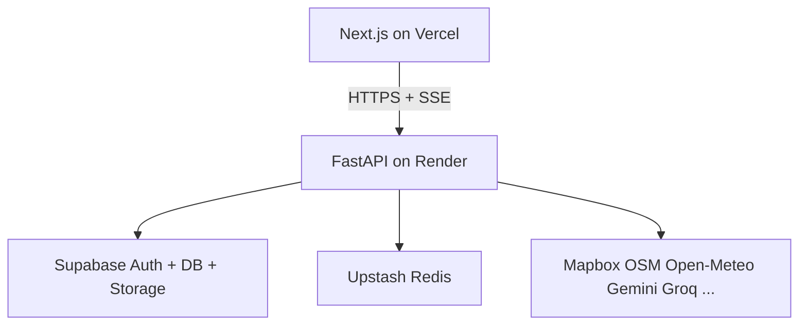

The workspace is open at **AI Travel Planner**. I have gone through `PROJECT_SPEC.md` (source of truth) and `docs/AI_ARCHITECTURE_REFERENCE.md` (prompts, schemas, pipeline classification). **No code will be written until you approve this plan.** Keys stay out of the repo; I will use Section 23 variable names and wait for you to paste values in chat.

**Rule of precedence:** where the architecture dump conflicts with the spec (Railway, TimeZoneDB, Groq-as-primary), **PROJECT_SPEC wins**: Render, Gemini → Groq → OpenRouter → deterministic, `timezonefinder` + `zoneinfo`.

---

## What we are building

**CuVoy** is a hybrid planner, not a chatbot:

- **LLM** — intent, ranking nuance, narrative, explainability, packing
- **APIs** — places, hours, weather, holidays, routes, GTFS
- **Algorithms** — H3, DBSCAN, OR-Tools, costs, crowd, group score
- **Validation** — schema, hours, geography, provenance

Frontend (Vercel / Next.js) never runs the planner. Backend (Render / FastAPI) is the only orchestration boundary. Free tiers only; never auto-pay.



---

## How the work is divided (12 parts)

Build order is dependency-first. Each part is a reviewable slice; later parts reuse earlier caches and contracts.

| Part | Name | What it delivers | Depends on |
|------|------|------------------|------------|
| **0** | Repo & contracts | Monorepo, env placeholders, shared types, Render/Vercel/CI stubs | — |
| **1** | Backend skeleton | FastAPI app, `/health`, config, CORS, logging, Sentry | 0 |
| **2** | Infrastructure | Upstash cache, credits, quotas, idempotency, job checkpoints | 1 |
| **3** | AI Gateway | Model router, JSON cleaner, prompts, circuit breaker | 1–2 |
| **4** | External data | Mapbox, OSM batch, weather, holidays, GTFS, supplementary APIs | 2 |
| **5** | Deterministic core | Reduce → H3 → DBSCAN → Matrix → OR-Tools → schedule → costs → crowd | 4 |
| **6** | Pipeline + API | 6-stage orchestrator, SSE, regenerate, validation gate | 3–5 |
| **7** | Persistence & auth | Supabase schema, RLS, save/share, GDPR delete | 2, 6 |
| **8** | Export | `.ics` (server), PDF (client canvas) | 6–7 |
| **9** | Frontend shell | Next.js 15, theme, landing, layout, cold-start fetch | 0 |
| **10** | Planner UI | Map + itinerary + Trip Controls + SSE progress | 6, 9 |
| **11** | Auth & trips UI | Google/email, save modal, share `/trip/{slug}` | 7, 9 |
| **12** | Tests, CI, legal, deploy | pytest, Vitest, Playwright, keep-alive, privacy/disclaimer | all |

Parts **0–8** are backend-heavy. Parts **9–11** are frontend. Part **12** runs in parallel from Part 5 onward (unit tests as algorithms land).

---

### Part 0 — Repo & contracts

Monorepo at the current folder. Shared Pydantic/Zod contracts so frontend and backend never drift.

**Deliverables:** `.gitignore`, `.env.example` files with **empty** Section 23 names, `render.yaml`, Vercel project hints, `packages/contracts` (or mirrored TS types), README with local run + key rotation.

---

### Part 1 — Backend skeleton

Single Render web service, 512 MB discipline from day one: no workers, no in-process Redis, no Pandas GTFS.

**Deliverables:** FastAPI entrypoint, settings from env, CORS (`cuvoy.vercel.app` + localhost), structured JSON logs (`request_id`, `stage`, `provider`, `cache_hit`), `GET /health`.

---

### Part 2 — Infrastructure

Three limit layers: **3 plans/day** (IP or account), **per-plan API envelope**, **global free-tier quotas**. Idempotency keys. Stage checkpoints in Upstash so a Render timeout resumes instead of restarting.

---

### Part 3 — AI Gateway

Every LLM call goes through one gateway. Pipeline services never call Gemini/Groq directly.

```
Gemini free → Groq free → OpenRouter free → deterministic fallback
paid_fallback = NEVER
```

JSON cleaner sits **before** Pydantic (strip fences, trailing commas — never invent fields). Prompts copied from the architecture reference: global system prompt, preference extraction, ranking, narrative, explainability, packing, regeneration interpretation.

---

### Part 4 — External data

Cache-first providers. OSM is **one city/region batch**, never per-attraction. Mapbox Search → OSM enrich → official-site verify (budget-capped, SSRF-safe). Weather: forecast if in horizon, else historical climate labeled `is_forecast: false`. GTFS: registry schema + on-demand fetch; compact artifacts only; **Cost unavailable** if no fares.

---

### Part 5 — Deterministic core (the planner brain)

```
~500 OSM → ~100 relevant → ~40 strong → clusters
  → 8–15 / cluster → Matrix → OR-Tools (≤10s) → 4–6 stops/day
  → Directions geometry → meals/buffers/travel days → costs/crowd
```

OR-Tools times out → greedy nearest-neighbor. DBSCAN fails → skip clustering. LLM never invents places, coords, hours, times, or prices.

---

### Part 6 — Pipeline orchestrator

The 10-step lifecycle from spec 7.22, exposed as:

| Method | Path |
|--------|------|
| POST | `/api/v1/plan` |
| POST | `/api/v1/plan/{id}/regenerate` |
| GET | `/api/v1/plan/{id}` |
| GET | `/api/v1/plan/{id}/status` (SSE + poll) |
| GET | `/api/v1/plan/{id}/export/pdf` (metadata; PDF is client) |
| GET | `/api/v1/plan/{id}/export/ics` |
| POST/GET | `/api/v1/trips` |

Regeneration reuses cached stages 1–3; locked stops are hard constraints.

---

### Part 7 — Persistence & auth

Supabase Auth: **Email + Google**. Anonymous planning works; save/share requires login. RLS: users own their trips. Service role stays on Render only.

---

### Part 8 — Export

PDF: client-side (`@react-pdf/renderer` or html2canvas + Mapbox canvas snapshot). `.ics`: server, `TZID` = destination IANA zone. Share: `cuvoy.vercel.app/trip/{slug}`.

---

### Part 9–11 — Frontend

Desktop: map | itinerary; Trip Controls as a **visible collapsible panel**, not buried settings. Mobile: itinerary primary, map as tab/sheet. Light/dark, **no gradients**. Cold start: **“Waking up the AI planner…”**, first-request timeout ≥90s. Transport cost toggle **OFF by default**; three labels: Verified / Estimated / Unavailable.

---

### Part 12 — Quality & deploy

Benchmark fixtures: Bengaluru, Jaipur, Tokyo, Interlaken, Paris. Keep-alive workflow already exists at `.github/workflows/keep-alive.yml` (keep it). Add lint/type/test CI. Privacy policy + AI disclaimer pages.

---

## All files to create

Existing files stay: `PROJECT_SPEC.md`, `docs/AI_ARCHITECTURE_REFERENCE.md`, `docs/_sections_27_34.md`, `.github/workflows/keep-alive.yml`.

### Root

```
.gitignore
README.md
.env.example                          # documents both frontend + backend names
render.yaml                           # FastAPI web service (512 MB, health /health)
.github/workflows/ci.yml
```

### Backend — `backend/`

```
backend/
  .env.example
  requirements.txt
  pyproject.toml                      # ruff, mypy, pytest
  Dockerfile                          # Render
  README.md
  app/
    __init__.py
    main.py                           # FastAPI app, CORS, lifespan
    config.py                         # pydantic-settings, Section 23 names
    logging.py
    deps.py                           # auth JWT, request_id
    api/
      __init__.py
      router.py
      health.py
      v1/
        __init__.py
        plan.py                       # POST/GET plan, status SSE
        regenerate.py
        trips.py
        export.py
        account.py                    # GDPR delete
    models/                           # Pydantic v2 — aligned with AI ref Part 2
      __init__.py
      common.py                       # money, timezone, cost_label, provenance
      input.py
      preferences.py
      place.py                        # canonical Place
      cluster.py
      route.py
      activity.py
      itinerary.py
      cost.py
      crowd.py
      weather.py
      explainability.py
      packing.py
      map.py
      job.py
      api.py                          # request/response contracts
    services/
      cache.py                        # Upstash REST, TTLs, MGET/MSET
      supabase.py                     # HTTPS client, no PG pool
      budget.py                       # plan credits + per-plan envelope
      quota.py                        # global provider quotas
      idempotency.py
      jobs.py                         # planning_jobs + Upstash checkpoints
    ai_gateway/
      __init__.py
      gateway.py
      router.py                       # Gemini → Groq → OpenRouter
      providers/
        gemini.py
        groq.py
        openrouter.py
      rate_limit.py
      circuit_breaker.py
      json_cleaner.py                 # Section 29.1
      prompts/
        system.py
        extract_preferences.py
        rank_candidates.py
        narrative.py
        explainability.py
        packing.py
        regeneration.py
        crowd_reasoning.py
      fallback.py                     # deterministic narrative/packing
    providers/
      mapbox_search.py
      mapbox_geocoding.py
      mapbox_matrix.py
      mapbox_directions.py
      osm_overpass.py                 # city/region batch + normalize
      osm_match.py                    # geo+category match, never LLM
      opentripmap.py
      geonames.py
      wikipedia.py
      openmeteo.py                    # forecast + historical climate
      nager.py
      sunrise.py
      website_verify.py               # SSRF allowlist, 5s timeout
      gtfs/
        registry.py                   # schema; URLs filled after verify pass
        fetch.py
        fares.py                      # compact artifacts only
        artifacts/                    # preprocessed benchmark stubs
    geo/
      timezone.py                     # timezonefinder
      h3_index.py
      dbscan.py                       # adaptive epsilon
      candidate_reduce.py
    optimize/
      ortools_solver.py               # ≤10s, ≤20 stops/day
      greedy.py                       # fallback
      group_score.py
    schedule/
      builder.py                      # local times, dwell, buffers
      meals.py
      travel_days.py
      conflicts.py                    # hours + reservation flags
    scoring/
      costs.py                        # formulas + GTFS; never LLM prices
      crowd.py
      ranking.py
    pipeline/
      orchestrator.py                 # 6 stages + SSE
      stages/
        extract.py                    # Stage 1
        discover.py                   # Stage 2
        reduce.py                     # Stage 3
        cluster_matrix.py             # Stage 4
        optimize_schedule.py          # Stage 5
        narrative_validate.py         # Stage 6
      regenerate.py
      sse.py
    validation/
      schema.py
      semantic.py
      geographic.py
      provenance.py
      cross_schema.py
    export/
      ics.py
    supabase/
      migrations/
        001_init.sql                  # users link, trips, planning_jobs, exports
        002_rls.sql
  tests/
    conftest.py
    unit/
      test_json_cleaner.py
      test_timezone.py
      test_candidate_reduce.py
      test_dbscan.py
      test_ortools.py
      test_costs.py
      test_crowd.py
      test_group_score.py
      test_budget.py
      test_schedule.py
    integration/
      test_health.py
      test_plan_credits.py
      test_idempotency.py
      test_free_tier_stop.py
    benchmarks/
      test_destinations.py            # 5 cities
      fixtures/
        bengaluru.json
        jaipur.json
        tokyo.json
        interlaken.json
        paris.json
```

### Frontend — `frontend/` (Next.js 15 App Router)

```
frontend/
  .env.example
  package.json
  tsconfig.json
  next.config.ts
  tailwind.config.ts
  components.json                     # shadcn
  public/
    logo.png                          # you provide the asset
  src/
    app/
      layout.tsx
      page.tsx                        # landing + planner entry
      globals.css                     # CSS vars, no gradients
      privacy/page.tsx
      plan/[id]/page.tsx              # noindex
      trip/[slug]/page.tsx            # share, read-only
      saved/page.tsx
      auth/callback/page.tsx
    lib/
      api.ts                          # FastAPI client, 90s cold-start timeout
      supabase.ts
      query.ts                        # TanStack Query
      types.ts                        # Zod + TS mirrors of backend models
      timezone.ts
      ics.ts                          # download helper
    hooks/
      usePlan.ts                      # POST plan + SSE
      useRegenerate.ts
      useColdStart.ts                 # ping /health, wake copy
      useTripControls.ts
    context/
      TripControlsContext.tsx
      ThemeProvider.tsx               # next-themes
    components/
      ui/                             # shadcn primitives
      layout/
        Header.tsx
        AppShell.tsx
      planner/
        PlannerPage.tsx
        InputBar.tsx
        MapPanel.tsx
        ItineraryPanel.tsx
        TripControls.tsx
        MealBlock.tsx
        StopCard.tsx
        CostLabel.tsx                 # Verified | Estimated | Unavailable
        CrowdBadge.tsx
        Warnings.tsx
        ProgressSSE.tsx
        ColdStartBanner.tsx
      auth/
        SaveTripModal.tsx
        LoginButtons.tsx
      export/
        PdfExport.tsx
        IcsDownload.tsx
    tests/
      timezone.test.ts
      schemas.test.ts
    e2e/
      plan-flow.spec.ts
      trip-controls.spec.ts
      export.spec.ts
```

### Shared contracts (optional but recommended)

```
packages/contracts/
  openapi.json                        # generated from FastAPI
  README.md
```

**~140–160 files** in total. I will not dump unused schema files from the 2.6M-character architecture dump; only schemas that the pipeline actually consumes.

---

## Env vars I will wire (Section 23) — placeholders only until you paste keys

**Frontend (Vercel / `.env.local`)**

- `NEXT_PUBLIC_SUPABASE_URL`
- `NEXT_PUBLIC_SUPABASE_ANON_KEY`
- `NEXT_PUBLIC_MAPBOX_ACCESS_TOKEN`
- `NEXT_PUBLIC_FASTAPI_URL`

**Backend (Render dashboard / `.env`)**

- `MAPBOX_ACCESS_TOKEN`
- `SUPABASE_SERVICE_ROLE_KEY`
- `UPSTASH_REDIS_REST_URL`
- `UPSTASH_REDIS_REST_TOKEN`
- `GEMINI_API_KEY`
- `GROQ_API_KEY`
- `OPENROUTER_API_KEY`
- `OPENTRIPMAP_API_KEY`
- `GEONAMES_USERNAME`
- `FASTAPI_SECRET_KEY`
- `CORS_ORIGINS`

**Also used (not in the Section 23 table, but required by spec 7.6 / keep-alive)**

- `SENTRY_DSN` (optional, free tier)
- GitHub Actions: `RENDER_HEALTH_URL`, `SUPABASE_URL`, `SUPABASE_ANON_KEY`

I will **not** commit secrets. When you paste keys in chat, they go into local `.env` / `.env.local` only.

**Not used (explicitly rejected by spec):** Railway, TimeZoneDB, Google Places, Google Calendar OAuth, Fly.io, third-party email.

---

## Suggested first build slice (after you approve)

**Part 0 + Part 1 + Part 9 shell** so you can run:

- `frontend` on `localhost:3000` (landing, theme, layout, logo slot)
- `backend` on `localhost:8000` with `GET /health`
- empty env files ready for keys

Then Part 2–6 (real planning), then UI wiring, then auth/export/tests.

